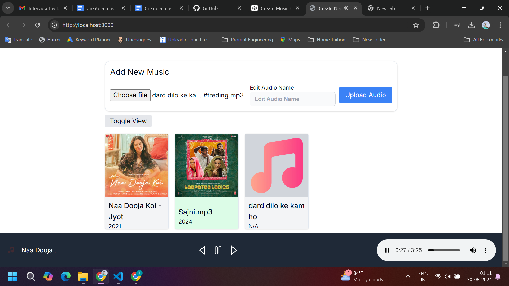
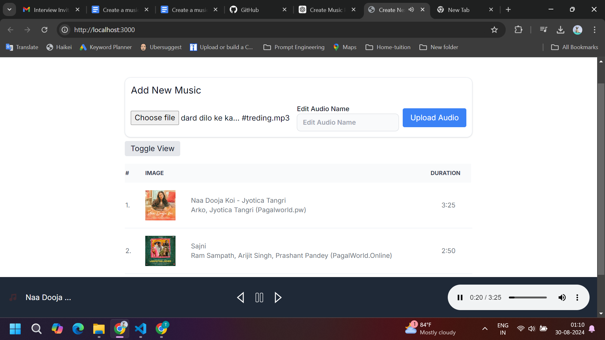

# Next.js Music Player

This project is a music player application built with Next.js, TypeScript, Tailwind CSS, and Shadcn UI. It allows users to upload audio files, display them in a list or grid view with associated metadata (album, artist, duration, year, and album art), and play them with a YouTube Music-like player interface.

## Features

- **Audio Upload**: Users can upload audio files. Metadata such as album, artist, duration, year, and album art are extracted automatically.
- **View Modes**: Toggle between a table view and a grid view to display the audio list.
- **Audio Playback**: Play audio with a music player interface, including controls for play, pause, next, and previous.
- **Metadata Display**: Displays metadata including album, artist, duration, year, and album art.
- **Current Song Highlight**: The currently playing song is highlighted in green.
- **Autoplay**: Automatically plays the next song after the current song finishes.

## Screenshots

Add screenshots of your project in action to help users understand what to expect. Place your screenshots in the `public/screenshots` directory and link them here.

### Example Screenshot 1: Grid View


### Example Screenshot 2: List View


## Technologies Used

- **[Next.js](https://nextjs.org/)**: A React framework for server-side rendering and generating static websites.
- **[TypeScript](https://www.typescriptlang.org/)**: A typed superset of JavaScript that compiles to plain JavaScript.
- **[Tailwind CSS](https://tailwindcss.com/)**: A utility-first CSS framework for rapidly building custom designs.
- **[Shadcn](https://shadcn.dev/)**: A collection of components built on top of Radix UI and Tailwind CSS.
- **[music-metadata](https://github.com/Borewit/music-metadata)**: A library for extracting metadata from audio files.

## Getting Started

### Prerequisites

- **Node.js**: Ensure you have Node.js installed. You can download it from [here](https://nodejs.org/).
- **npm or yarn**: npm is installed with Node.js. You can install yarn globally using npm if preferred:
  ```bash
  npm install -g yarn
